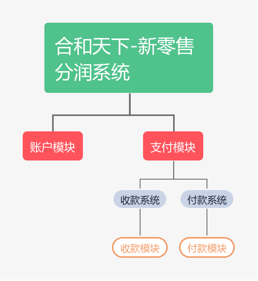
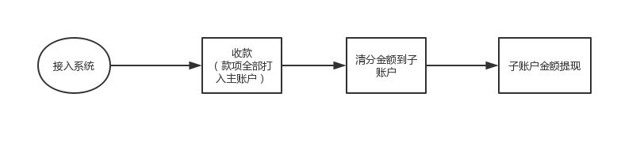

## 说明

合和天下的账户和支付服务。

接入合和天下的账户和支付，即可简单的实现合和天下的复杂分润功能。

### 账户系统

合和天下保存账户（包括主账户和其对应的子账户）的余额。其他的数据建议开发者自行处理。合和天下账户系统保存账户的余额和变动情况。

### 支付系统

包括所有的支付有关的功能，包括清分、收款、提现到银行卡三大主要功能。 

### 主要业务流程

## 开始接入

您需要获取您的唯一身份标识（uid）和接口访问令牌（key）来接入“合和天下”系统。